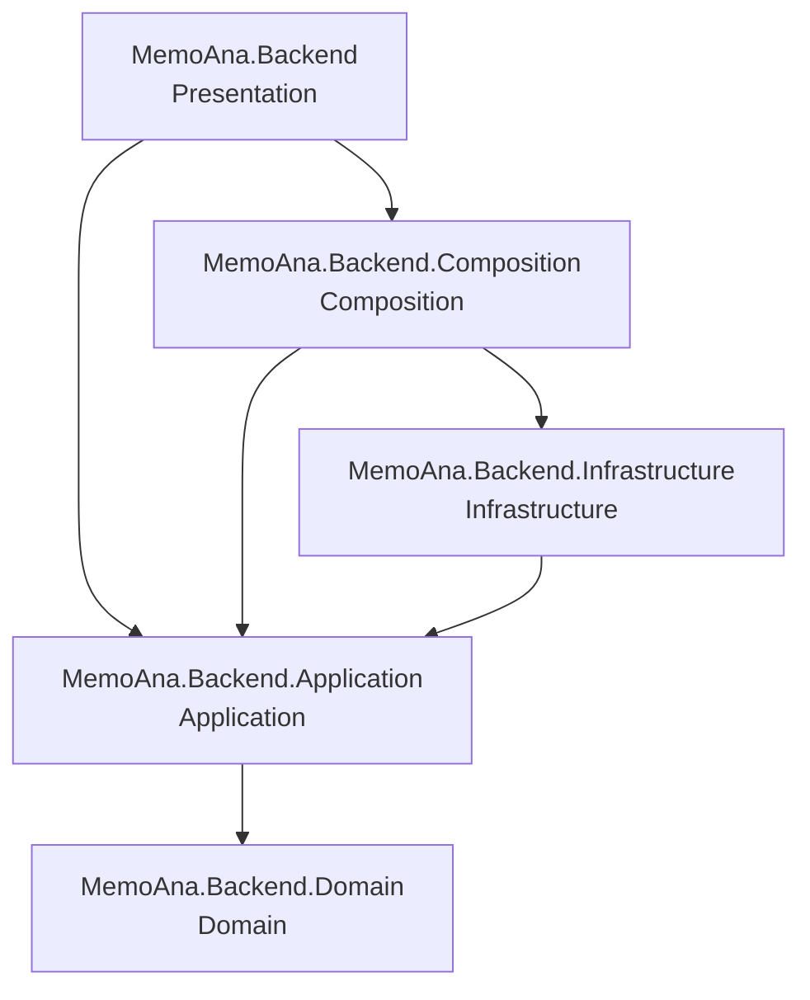

# MemoAna Backend Architecture

## Runtime

MemoAna uses ASP.NET Core/.NET 10 for the backend and a MAUI Blazor Hybrid client. The backend solution is represented by `MemoAna.Backend.slnx` and contains the five DDD-oriented projects plus backend tests.

## Layers

### Presentation — `MemoAna.Backend`

Hosts the ASP.NET Core application, Web API controllers and Interactive Server Blazor components. It composes the application through the Composition project and consumes Application contracts. Authentication/authorization middleware is part of the HTTP pipeline, while identity business operations remain in Application/Infrastructure.

### Application — `MemoAna.Backend.Application`

Defines use cases and application-facing abstractions. The existing Identity feature follows a command/query/handler structure, with requests, responses, validators and abstractions. Handlers orchestrate use cases and must not depend directly on provider SDKs.

### Composition — `MemoAna.Backend.Composition`

Owns the composition root: service registration, options binding, authentication/authorization setup, mediator/pipeline registration, persistence configuration and application pipeline setup. Provider-specific authentication registration belongs here when it is part of ASP.NET authentication configuration.

### Domain — `MemoAna.Backend.Domain`

Contains domain concepts and rules. It must remain independent of ASP.NET Core, EF Core, Google SDKs and other infrastructure concerns.

### Infrastructure — `MemoAna.Backend.Infrastructure`

Contains concrete implementations for persistence and external services. The existing Identity implementation lives here, including Identity models, options and services. Google provider SDK integration belongs here when it requires calls to Google APIs; expose an Application abstraction instead of leaking Google SDK types across the layer boundary.

## Dependency graph

## Identity architecture

The current Identity implementation uses ASP.NET Core Identity with `User`, `Role`, EF Core persistence, `IIdentityService`, JWT token issuance, refresh/revocation support, validators, mediator handlers and authorization policies. The Composition root registers Identity and JWT authentication. The HTTP pipeline invokes authentication before authorization.

The Google Play Games authentication capability must be additive. It is an alternative credential acquisition path, not a replacement for local password-based Identity. A successful Google authentication must resolve to the same application user model and ultimately to the same MemoAna JWT/session model used by the existing client, unless the existing contract proves otherwise.

Provider SDK types must not become Application contracts. Validate the provider credential server-side, map the provider identity to a local Identity user, provision/link the local user when appropriate, and issue the application's own tokens. Never trust a user-supplied email/name as proof of Google identity.

The exact Google Play Games authentication flow must be verified against the versions already installed in `MemoAna.Backend.Infrastructure.csproj` and current Google API semantics before implementation. Do not invent SDK methods or assume that a package provides an OAuth flow it does not provide.

## Error handling

Expected invalid credentials, duplicate identities, missing users and provider validation failures should be represented by explicit application/domain exceptions or result contracts consistent with the existing feature. Unexpected exceptions should reach the application's global exception handling pipeline. Never expose provider stack traces, credentials or sensitive token material to clients.

## Async and resources

All I/O is asynchronous. Cancellation must flow from the HTTP/application boundary into EF Core and provider calls. Dispose resources owned by application code with `using`/`await using`; do not dispose DI-owned services.
